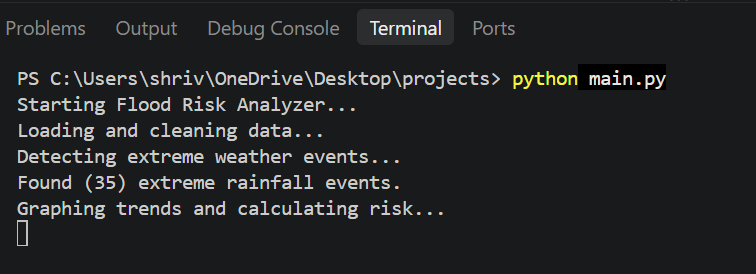
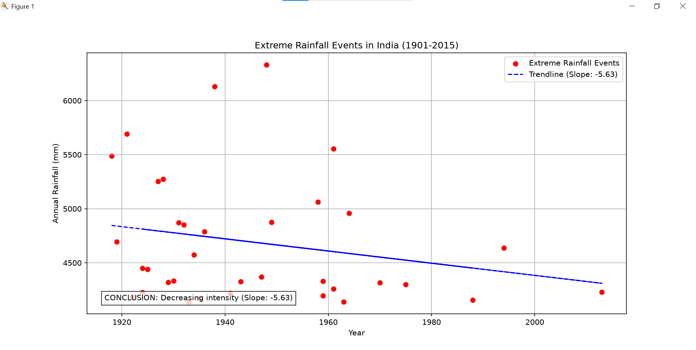

# Flood Risk Analyzer 

This project is a Python-based data analysis pipeline designed to identify and visualize extreme annual rainfall events in India (1901-2015). It processes historical weather data, applies statistical models to find severe outliers, and generates a visualization to check for increasing or decreasing intensity over time.

# Project Overview

The pipeline is built using a modular architecture, meaning the code is split into specific files based on their job. This keeps the logic organized and easy to maintain.

# Tech Stack

* Pandas: For loading, cleaning, and managing the DataFrame.
* NumPy: For heavy mathematical calculations (Mean, Standard Deviation, and Polynomial Fitting).
* Matplotlib: For rendering the final scatter plot and trendline.

# File Structure

* `main.py`: The master orchestrator. This file imports the other modules, passes the data between them, and runs the main program.
* `data_processor.py`: The ETL (Extract, Transform, Load) module. It loads the raw `data/rainfall.csv`, drops missing values, and extracts only the relevant columns (`SUBDIVISION`, `YEAR`, `ANNUAL`).
* `anomaly_detector.py`: The math engine. It calculates the Z-scores for every year and filters out everything except the extreme anomalies.
* `visualizer.py`: Generates the final graph, calculates the line of best fit, and stamps a conclusion directly on the canvas.

# How the Math Works

 1. Z-Score Calculation

To figure out if a year had "extreme" rainfall, the program calculates the Z-score for every single year using this formula:

**Z-Score Formula:**  
Z = (x - μ) / σ

Where:
* x = the year's actual rainfall
* μ (mu) = the historical average rainfall
* σ (sigma) = the standard deviation

*Note: Any year with a Z-score of 3.0 or higher is flagged as a dangerous outlier.*

2. Trendline (Linear Regression)

The visualizer uses NumPy's `polyfit` function to calculate a 1st-degree polynomial (a straight line of best fit: y = mx + c). If the slope (m) is positive, the graph automatically concludes that the intensity of extreme events is increasing over time.

# How to Run the Project

1. Ensure you have Python installed along with the required libraries:
pip install pandas numpy matplotlib

2. Place your raw dataset in a folder named data/ and name the file rainfall.csv.

3. Run the main script from your terminal:
python main.py

# Instructions for Testing 
1. Ensure your sample dataset is correctly placed in the data/ directory as rainfall.csv

2. Execute python main.py in your terminal

3. Verify that the console prints the correct number of rows processed and the exact count of anomalies found

4. Confirm that a Matplotlib window opens displaying the scatter plot, trendline, and automated conclusion box

5. lose the graph window to allow the script to complete its execution

# Screenshots 

# Features
* Data Processing: Automatically loads historical weather data, cleans missing values, and extracts relevant columns.
* Statistical Anomaly Detection: Calculates Z-scores to identify and filter extreme rainfall events.
* Automated Trend Analysis: Uses linear regression to determine if the intensity of extreme events is shifting over time.
* Data Visualization: Generates a custom scatter plot with a line of best fit and an embedded automated conclusion.